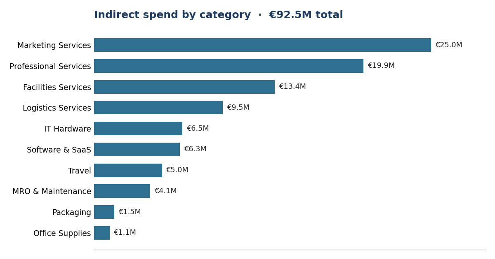
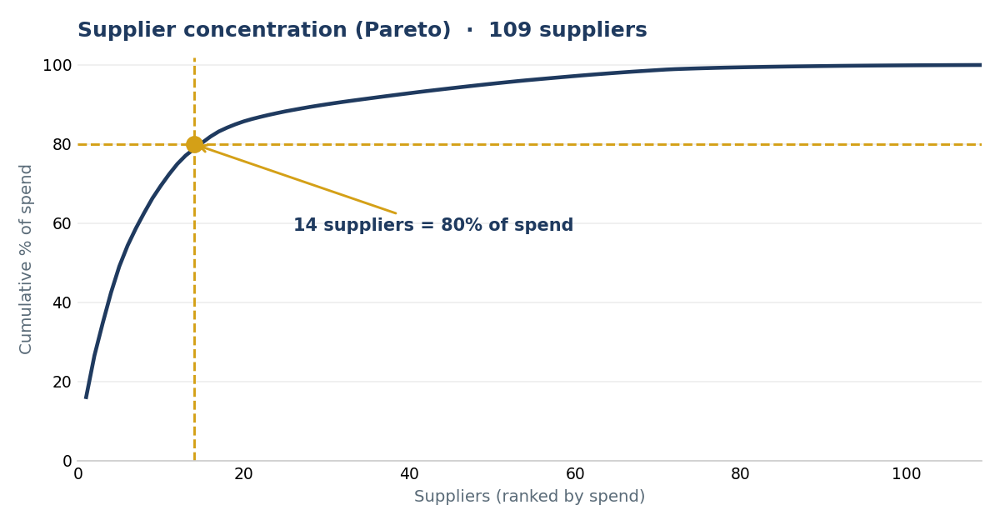
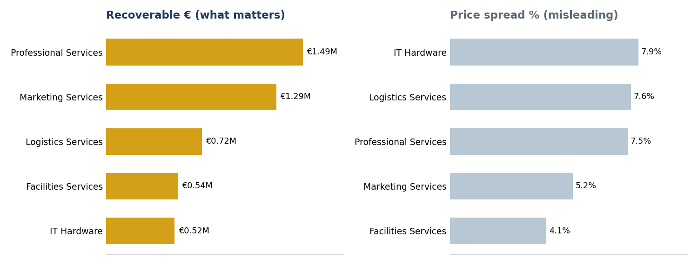
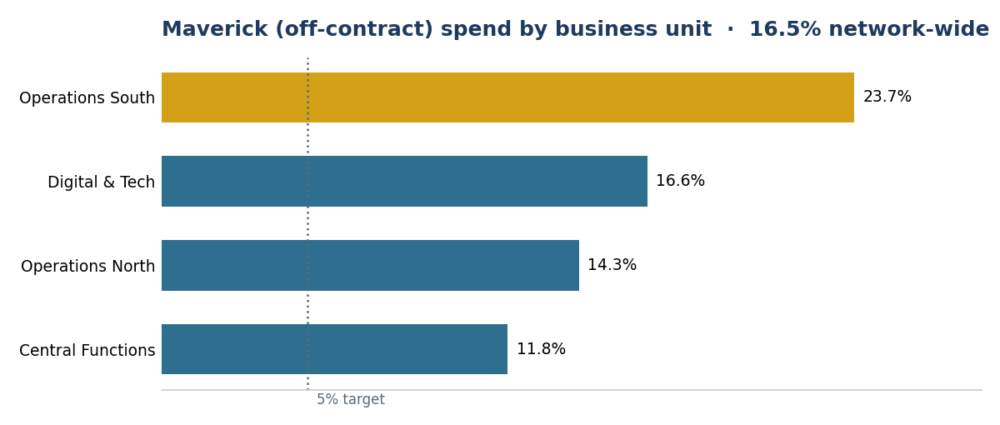

# Indirect Procurement Spend Analytics

**€92.5M of indirect spend, read as a sourcing agenda.** Supplier concentration, price variance, maverick spend and tail consolidation, analysed in SQL and turned into a consulting diagnosis, a savings bridge, and a 90-day roadmap.

I have worked in procurement and strategic sourcing for over seven years, mostly RFP management, supplier negotiation and enterprise accounts. I built this to do in SQL and Excel what I have long done with procurement tools and judgement: turn raw purchase-order data into sourcing decisions a client could act on.

All data is synthetic, generated by [`generate_data.py`](generate_data.py) with realistic procurement patterns built in. No employer or client data is used. Savings figures are modelled, not realised results.

| | |
|---|---|
| **Spend analysed** | €92.5M indirect · 109 suppliers · 118 items · 10 categories · 4 business units · 24 months |
| **Ceiling identified** | ~€4.0M/yr theoretical |
| **Recommended** | **€1.3M to €1.9M/yr** realistic, after capture-rate haircuts |
| **Delivered** | Consulting report · 11-slide executive deck · 90-day roadmap · Excel dashboard |
| **Stack** | SQL (SQLite) · window functions · CTEs · Python · Excel |

**Start here:** [the full case study](CASE-STUDY.md) · [the executive deck](Indirect-Spend-Optimisation-Deck.pdf) · [every query explained](STUDY-GUIDE.md)

---

## 1. The questions

A fast-growing logistics-tech scale-up buys around €46M a year of indirect goods and services across 10 categories and 4 business units. Ahead of a funding round, leadership asked:

1. Where does the money go?
2. How concentrated is our supplier base, and is that risk or leverage?
3. Are we paying different prices for the same items, and what is that worth?
4. How much spend bypasses our contracts, and what does it cost?
5. Where can we consolidate the supplier tail?
6. What should we do first, over the next 90 days?

## 2. Data model

SQLite, 6 tables, line-item grain: 13,199 PO lines across 4,400 purchase orders, 109 suppliers, 118 catalogue items, 10 categories, 24 months from July 2024 to June 2026.

```
business_units ──< po_lines >── suppliers ──< contracts
                     │    │
                  items  categories
```

The `contracts` table is what makes maverick-spend analysis possible: spend in a contracted category placed with a non-contracted supplier is off-contract. Everything runs off one calculation, `spend = quantity × unit_price`.

## 3. The queries

| File | Question | SQL concepts |
|---|---|---|
| [`01_data_quality_checks.sql`](01_data_quality_checks.sql) | Can we trust the data? | LEFT JOIN + IS NULL, consistency checks |
| [`02_spend_overview.sql`](02_spend_overview.sql) | Spend cube | window % of total, month bucketing |
| [`03_supplier_concentration.sql`](03_supplier_concentration.sql) | Pareto and ABC | cumulative SUM() OVER, classification |
| [`04_price_variance.sql`](04_price_variance.sql) | Same item, different price | MIN/MAX spreads, savings simulation |
| [`05_maverick_spend.sql`](05_maverick_spend.sql) | Off-contract buying | LEFT JOIN as a business signal |
| [`06_tail_spend.sql`](06_tail_spend.sql) | Supplier tail | threshold bucketing, opportunity sizing |

Raw outputs from every query: [`query_outputs.txt`](query_outputs.txt). Raw data and field dictionary: [`spend-raw-data.xlsx`](spend-raw-data.xlsx).

## 4. What the analysis found

### Spend is top-heavy



€92.5M over 24 months. Marketing at 27.0%, Professional Services at 21.6% and Facilities at 14.5% make up around 63% of the base. A clear October spike each year, roughly €5.0M against a €3.4M baseline, points to budget-flush behaviour. That is a governance flag rather than a sourcing one.

### Concentration cuts both ways



Just 14 suppliers, 12.8% of a 109-supplier base, carry 80% of spend. That is negotiating leverage, and it is also risk: the top supplier alone is 16.1% of total spend. On an ABC view, 14 A-suppliers hold €72.9M, 34 B-suppliers hold €14.9M, and 61 C-suppliers share just €4.8M between them.

### Price variance is the biggest prize, and it needs a reframe



Repricing all volume at each item's best observed price frees €5.68M, or 6.1% of spend, in theory. IT Hardware shows the worst discipline by percentage, with 33% to 37% spreads between the best and worst price paid for identical items.

But IT Hardware is a small category. Weighted by absolute euros, Professional Services at €1.49M and Marketing at €1.29M carry roughly three times the recoverable value.

**Percentage spread tells you where discipline is worst. Absolute euros tell you where to start.**

That reframe reordered the whole sourcing agenda, and it is the central judgement call of the study.

### Maverick spend is a process problem with a name



16.5% of network spend is off-contract, and it does not spread evenly. Operations South runs at 23.7% against 11.8% at Central Functions. Off-contract purchases carry an 8.4% average price premium for identical items, which annualises to roughly €1.2M of leakage. The fix is process rather than negotiation: catalogue coverage, approval workflows, and business-unit compliance reporting.

### Tail consolidation is real but modest

MRO and Maintenance carries 16 sub-€100k suppliers holding €534k of fragmented spend, and Office Supplies carries 14. At a standard 5% consolidation-capture assumption the prize is around €44k a year. Worth doing, but sequenced after the price-variance and maverick fixes.

## 5. The savings bridge

Theoretical ceilings overstate what sourcing actually captures. Each lever is scoped to where the euros are, then haircut by a realistic capture rate. Figures are annual run-rate, so the 24-month totals are halved.

| Lever | Identified /yr | Capture | **Realistic /yr** |
|---|---|---|---|
| Framework agreements and catalogue enforcement, top-5 categories | €2.28M | 30 to 50% | **€0.7M to €1.1M** |
| Maverick-spend compliance programme, Operations South first | €1.20M | 50 to 60% | **€0.6M to €0.7M** |
| Tail consolidation across MRO, Office Supplies and Packaging | €0.09M | ~50% | **€0.04M** |
| **Total** | **≈ €4.0M ceiling** | | **€1.3M to €1.9M** |

Why €1.3M to €1.9M and not €4.0M? The ceiling assumes every line is repriced to its best-ever price and every off-contract euro is recovered. Neither happens. The capture rates are stated assumptions that can be tightened once category owners validate scope, which I would rather do than quote a number I could not defend.

## 6. The recommended agenda

| # | Move | Realistic /yr |
|---|---|---|
| 1 | Framework agreements and catalogue enforcement, **Professional Services and Marketing first** because that is where the euros are, then IT Hardware where the spread is worst | €0.7M to €1.1M |
| 2 | Maverick-spend compliance programme, **Operations South first** | €0.6M to €0.7M |
| 3 | Tail consolidation across MRO, Office Supplies and Packaging | €0.04M |
| ⚠ | **De-risk the base.** Dual-source the top 3 suppliers and build a contract-expiry pipeline | risk, not savings |

Full reasoning, the 90-day roadmap and the risk register are in [CASE-STUDY.md](CASE-STUDY.md).

## 7. Excel dashboard

[`spend_dashboard.xlsx`](spend_dashboard.xlsx) is a live, formula-driven workbook with no hardcoded results. Over 13,500 SUMIF and SUMIFS formulas run across the raw PO lines, feeding a KPI header and four charts: spend by category, monthly trend, maverick percentage by business unit, and top-10 suppliers. Built by [`build_dashboard.py`](build_dashboard.py).

## 8. Consulting deliverables

| Deliverable | Format |
|---|---|
| Written consulting report: situation, diagnostic, savings bridge, recommendations, roadmap, risks | [PDF](Indirect-Spend-Optimisation-Case-Study.pdf) · [Word](Indirect-Spend-Optimisation-Case-Study.docx) |
| Executive deck, 11 slides with speaker notes | [PDF](Indirect-Spend-Optimisation-Deck.pdf) · [PowerPoint](Indirect-Spend-Optimisation-Deck.pptx) |

## 9. Reproduce it

```bash
python3 generate_data.py     # writes spend.db, seeded so it is reproducible
python3 build_dashboard.py   # rebuilds the Excel dashboard from spend.db
```

Then run any query, for example:

```bash
sqlite3 spend.db < 02_spend_overview.sql
```

## 10. Limitations and next steps

The synthetic data simplifies reality. There are no payment terms, currencies, credit notes, or supplier parent and child hierarchies, and the savings estimates use rule-of-thumb capture rates.

Price-variance analysis assumes items are genuinely comparable, and some of the spread may reflect specification or service-level differences rather than pure price.

Three fields are present but not yet used: `suppliers.country`, `contracts.valid_from` and `valid_to`, and `items.list_price`. Those are the natural next steps, giving a supplier-risk overlay for single-source categories, a contract-expiry pipeline, and a paid-against-list price compliance view.

---

Shruti Morab. Procurement and Strategic Sourcing, Berlin.
[LinkedIn](https://linkedin.com/in/shruti-morab) · [GitHub](https://github.com/ShrutiSMorab)

MIT licensed. All data synthetic.
